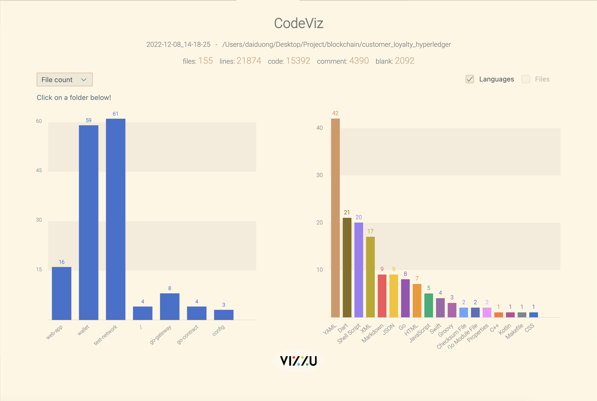
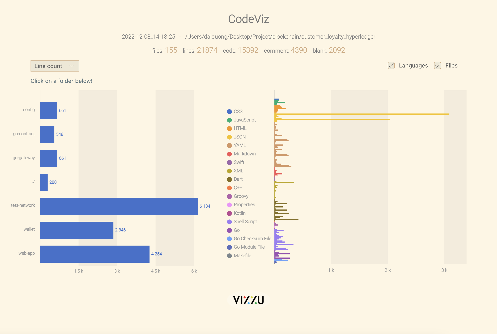

# Customer loyalty hyperledger

A blockchain system that stores loyalty points transparently

## Installation

- [Go](https://go.dev/doc/install)
- [Docker](https://www.docker.com/)
- [ngrok](https://ngrok.com/)

Chạy `make install` để cài docker image và binary cần thiết cần thiết

### Sử dụng wallet app

Cài đặt [flutter](https://docs.flutter.dev/get-started/install) nếu muốn chạy app wallet

## Pre-run

Export `binary` to PATH
```bash
export PATH=$PATH:$PWD/bin
```

## Run the network

Vào thư mục `test-network` để thực hiện tất cả các dòng lệnh phía dưới
```bash
make run_network
```

Đã xong phần build chaincode và mở các cổng để kết nối ra ngoài

## Run the gateway

Vào thư mục `go-gateway` để thực hiện tất cả các dòng lệnh phía dưới
```bash
cd go-gateway
```

Chạy gateway server
```bash
go get
go run customer_loyalty.go
```

Expose localhost lên mạng bằng `ngrok`
```
ngrok http 8181
```

## Run the client

Vào thư mục `web-app` để thực hiện tất cả các dòng lệnh phía dưới
```bash
cd web-app
```

Chạy client
```bash
npm install
npm run start
```

## Run the wallet

Vào thư mục `wallet` chạy lệnh
```
flutter run
```

Tạo người dùng và partner bằng web-admin bên trên, đăng nhập sử dụng trên wallet

## Thông số mã nguồn



